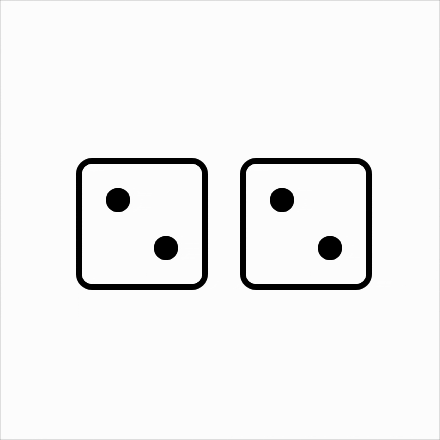

# @scriptless/react-dice

[![NPM Version][npm-image]][npm-url]
[![MIT License][license-image]][license-url]

A React dice component with inky rolling animations.



---

I designed this component to work a little bit like an input. When it's enabled, a click from a user is a request for a new dice roll. The component can handle coming up with a value - or in cases where cheating is a concern, it can make a call to your server to get a new value using `getNextValue`.

When a roll is done, the component will deliver its value to its `onChange`. If you want the dice to show a particular value before its first roll, pass that down with the `initialValue` prop.

## Installation

```bash
npm install @scriptless/react-dice --save
```

## Basic Usage

```jsx
import { Dice } from "@scriptless/react-dice";
import "@scriptless/react-dice/styles.css";

function App() {
  return <Dice onChange={(value) => console.log("New value:", value)} />;
}
```

## Group Usage

```jsx
import { DiceGroup, Dice } from "@scriptless/react-dice";
import "@scriptless/react-dice/styles.css";

function App() {
  const diceValueFromServer = useFetchValue();

  const [
    diceValue, // use me for other UI elements, no need to pass me to the dice component
    setDiceValue,
  ] = useState(undefined);

  return (
    <DiceGroup
      onChange={setDiceValue} // this will get called with an array of three values
    >
      <Dice />
      {/* dice will work with any arbitrary dom structure */}
      <div style={{ border: "1px solid black", padding: 40 }}>
        <Dice />
        <div style={{ position: "absolute", top: 0 }}>
          <Dice />
        </div>
      </div>
    </DiceGroup>
  );
}
```

## API Reference

### Dice Component Props

| Prop                 | Type                              | Default   | Description                           |
| -------------------- | --------------------------------- | --------- | ------------------------------------- |
| `initialValue`       | `number`                          | `1`       | Initial value of the die (1-6)        |
| `onChange`           | `(value?: number) => void`        | -         | Callback fired when die value changes |
| `getNextValue`       | `() => number \| Promise<number>` | `random`  | Function to generate next die value   |
| `disabled`           | `boolean`                         | `false`   | Disables die rolling                  |
| `size`               | `number`                          | `66`      | Size of the die in pixels             |
| `pipSize`            | `number`                          | `12`      | Size of the pips in pixels            |
| `borderColor` \*     | `string`                          | `'black'` | Color of die border                   |
| `borderRadius`       | `number`                          | `8`       | Border radius in pixels               |
| `borderWidth`        | `number`                          | `3`       | Border width in pixels                |
| `backgroundColor` \* | `string`                          | `'white'` | Die background color                  |
| `pipColor` \*        | `string`                          | `'black'` | Color of the pips                     |

> \* be careful with these props, because this component works by blurring and contrasting for the inky effect, colors of similar luminosity may cause a strange strobe effect during roll

### DiceGroup Component Props

| Prop        | Type                         | Default                            | Description                               |
| ----------- | ---------------------------- | ---------------------------------- | ----------------------------------------- |
| `onChange`  | `(values: number[]) => void` | -                                  | Callback fired when any die value changes |
| `disabled`  | `boolean`                    | `false`                            | Disables rolling for all dice             |
| `className` | `string`                     | -                                  | Additional CSS class                      |
| `style`     | `CSSProperties`              | `{ display: 'flex', gap: '10px' }` | Inline styles                             |

## Advanced Usage

### Get your dice values from a server

```jsx
const CustomDice = () => {
  const diceValueFromServer = useFetchFromServer();

  const [
    diceValue, // use me for other UI elements, no need to pass me to the dice component
    setDiceValue,
  ] = useState(undefined);

  const getNextValue = async () => {
    const response = await fetch("https://api.random.org/v1/dice");
    const data = await response.json();
    return data.value;
  };

  return (
    <Dice
      initialValue={diceValueFromServer}
      onChange={setDiceValue}
      getNextValue={getNextValue}
    />
  );
};
```

### Styled Dice

```jsx
const StyledDice = () => (
  <Dice borderWidth={2} borderRadius={20} size={80} pipSize={14} />
);
```

## License

MIT © Gus Nordhielm

[npm-image]: https://img.shields.io/npm/v/@scriptless/react-dice.svg
[npm-url]: https://npmjs.org/package/@scriptless/react-dice
[license-image]: https://img.shields.io/badge/license-MIT-blue.svg
[license-url]: LICENSE

## To do, contributions welcome

- [x] Better same-to-same number animations, e.g. two dots should switch sides, one dot should pulse
- [ ] Use rolling as a loader, when I'm waiting for an async getNextValue, I should see feedback immediately
- [ ] When I rapid click a dice item, they weirdly alternate rolls
- [ ] On initial click, there's like a little bounce - but this happens inconsistently and sometimes twice, worth making that consistent
- [ ] Custom colors are causing weird behaviors - e.g. dark bg with dark pips make them bleed a lot, perhaps there's a way of using b/w pips and then masking them over the background. Also the background is flashing with the contrast setting.
